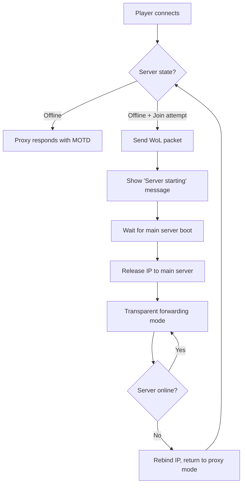

# 🎮 Wake-on-LAN Game Server Proxy

> **Sparen Sie Energie! Lassen Sie Ihren Gaming Server nur dann laufen, wenn wirklich gespielt wird.**

Ein robuster, produktionsbereiter Python-Service, der als transparenter Proxy für Game Server fungiert und Ihren Hauptserver automatisch per Wake-on-LAN aufweckt, wenn Spieler beitreten möchten. Speziell für stromsparende ARM-Boards entwickelt, die 24/7 laufen, während Ihr Gaming-PC aus bleibt, bis er gebraucht wird.

[](https://www.python.org/downloads/)
[](https://opensource.org/licenses/MIT)
[](https://www.arm.com/)

## 📺 Demo

```
🔴 Server PC: OFF (0W Stromverbrauch)
🟢 Tinker Board: Proxy aktiv (5W)

Spieler verbindet sich → 💤 WoL Magic Packet → 🚀 Server startet
├── Minecraft: "Join to start server" → Login → Server wake
└── Satisfactory: UDP Traffic → Sofortiger Wake
```

## 🎮 Supported Games

- **Minecraft (Java Edition)** - Full protocol support with custom server list status and login detection
- **Satisfactory** - UDP traffic detection on game ports (7777, 15000, 15777)

## ✨ Key Features

- **Zero Manual Intervention** - Fully automated wake/sleep cycles
- **Protocol-Aware** - Distinguishes between server status pings and real join attempts
- **Transparent Proxying** - Seamless handoff to main server when online
- **ARM Board Optimized** - Minimal resource usage (<50MB RAM)
- **Production Ready** - Systemd integration, logging, monitoring, and error handling
- **Configurable** - All settings externalized in JSON configuration
- **Secure** - Minimal privileges, sandboxed execution

## 🏗️ How It Works



### State Machine

1. **OFFLINE** - Proxy owns the server IP, shows "Join to start server" in server lists
2. **WAKING** - WoL packet sent, brief transition state  
3. **STARTING** - Server booting, shows "Server starting" messages
4. **PROXYING** - Main server online, transparent traffic forwarding
5. **MONITORING** - Watching main server health, ready to resume proxy mode

## 📋 Requirements

### Hardware
- ARM board (Raspberry Pi 3+, ASUS Tinker Board, etc.) or any Linux system
- Minimum 512MB RAM, 1GB storage
- Ethernet connection (WiFi not recommended)

### Software  
- Debian-based OS (Raspberry Pi OS, Armbian, Ubuntu)
- Python 3.9+
- Network interface management capabilities
- Systemd for service management

### Network Setup
- Static IP address for your gaming PC
- Wake-on-LAN enabled on gaming PC
- Port forwarding configured for game ports (if remote access needed)

## 🚀 Quick Installation

### Option 1: Automated Installation (Recommended)

```bash
# Download and run the installer
sudo ./install.sh
```

### Option 2: Manual Installation

```bash
# Install system dependencies
sudo apt update && sudo apt install -y python3 python3-pip python3-venv git iputils-arping

# Clone repository
git clone https://github.com/example/wol-game-proxy.git
cd wol-game-proxy

# Create virtual environment
python3 -m venv venv
source venv/bin/activate

# Install Python dependencies
pip install -r requirements.txt

# Generate example configuration
python3 main.py --create-config

# Edit configuration with your settings
cp config.json.example config.json
nano config.json
```

## ⚙️ Configuration

Edit `config.json` with your specific settings:

```json
{
  "server": {
    "target_ip": "192.168.1.100",         // Your gaming PC's IP
    "mac_address": "00:1B:44:11:3A:B7",   // Your gaming PC's MAC address
    "network_interface": "eth0"            // Network interface on proxy device
  },
  "timing": {
    "boot_wait_seconds": 90,              // Max time to wait for server boot
    "health_check_interval": 15,          // Server health check frequency
    "wol_retry_interval": 5,              // Time between WoL retries
    "connection_timeout": 30              // Network timeout for connections
  },
  "minecraft": {
    "enabled": true,                      // Enable Minecraft support
    "port": 25565,                        // Minecraft server port
    "motd_offline": "§aJoin to start server",
    "motd_starting": "§eServer is starting, please wait",
    "kick_message": "§eServer is starting up, try joining again in a minute."
  },
  "satisfactory": {
    "enabled": true,                      // Enable Satisfactory support
    "game_port": 7777,                    // Main game port
    "query_port": 15000,                  // Query port
    "beacon_port": 15777                  // Beacon port
  }
}
```

### Key Configuration Steps

1. **Find your target server's MAC address:**
   ```bash
   # On Windows (run as admin):
   ipconfig /all
   
   # On Linux:
   ip addr show eth0
   
   # Or from another device:
   ping YOUR_SERVER_IP
   arp -a | grep YOUR_SERVER_IP
   ```

2. **Edit the configuration file:**
   ```bash
   # After installation, edit the config:
   sudo nano /etc/wol-proxy/config.json
   
   # Update these values:
   # "target_ip": "YOUR_SERVER_IP"
   # "mac_address": "YOUR_SERVER_MAC"
   ```

3. **Set up sudo permissions (done automatically by installer):**
   ```bash
   # The installer creates this automatically:
   echo "wol-proxy ALL=(ALL) NOPASSWD: /sbin/ip addr add *, /sbin/ip addr del *" | sudo tee /etc/sudoers.d/wol-proxy
   ```

4. **Validate your configuration:**
   ```bash
   python3 main.py --validate-config --config /etc/wol-proxy/config.json
   ```

## 🎯 Gaming PC Setup

### Target Server Setup (Windows/Linux)

1. **Enable Wake-on-LAN in BIOS/UEFI:**
   - Boot to BIOS settings
   - Look for "Wake on LAN", "WoL", or "Power Management" settings
   - Enable relevant options

2. **Windows Network Settings:**
   ```powershell
   # Run PowerShell as Administrator
   # Enable Wake on Magic Packet
   Get-NetAdapter | Set-NetAdapterPowerManagement -WakeOnMagicPacket Enabled
   
   # Verify settings
   Get-NetAdapterPowerManagement
   ```

3. **Linux Network Settings:**
   ```bash
   # Enable WoL on network interface
   sudo ethtool -s eth0 wol g
   
   # Verify settings
   sudo ethtool eth0 | grep "Wake-on"
   ```

4. **Firewall Configuration:**
   
   **Windows:**
   ```powershell
   # Allow game server ports (run as Administrator)
   netsh advfirewall firewall add rule name="Minecraft Server" dir=in action=allow protocol=TCP localport=25565
   netsh advfirewall firewall add rule name="Satisfactory Game" dir=in action=allow protocol=UDP localport=7777
   netsh advfirewall firewall add rule name="Satisfactory Query" dir=in action=allow protocol=UDP localport=15000
   ```
   
   **Linux:**
   ```bash
   # UFW firewall
   sudo ufw allow 25565/tcp
   sudo ufw allow 7777/udp
   sudo ufw allow 15000/udp
   sudo ufw allow 15777/udp
   ```

## 🔧 Usage

### Running the Service

```bash
# Start the proxy
python3 main.py

# With custom config
python3 main.py --config /path/to/config.json

# Validate configuration
python3 main.py --validate-config

# Check status (if monitoring enabled)
python3 main.py --status
```

### Systemd Service Management

```bash
# Install and start service
sudo systemctl enable --now wol-proxy.service

# Check status
sudo systemctl status wol-proxy.service

# View logs
journalctl -u wol-proxy.service -f

# Restart service
sudo systemctl restart wol-proxy.service
```

### Monitoring and Logs

```bash
# Real-time log monitoring
tail -f /var/log/wol-proxy.log

# Service status via HTTP (if enabled)
curl http://localhost:8080/status

# Check proxy statistics
curl http://localhost:8080/status | jq '.proxy.statistics'
```

## 🎮 Game-Specific Behavior

### Minecraft

- **Server List Status**: Shows custom MOTD based on server state
  - Offline: "🟢 Join to start server" 
  - Starting: "🟡 Server is starting, please wait"
- **Join Attempts**: Detects real login attempts vs status pings
- **Protocol Support**: Compatible with modern Minecraft versions (1.19+)
- **Custom Messages**: All text fully configurable

### Satisfactory

- **Limitations**: Cannot appear "online" in server browser due to protocol complexity
- **Wake Trigger**: Any UDP traffic on game ports triggers server wake
- **Connection Method**: Players should connect via direct IP
- **Port Forwarding**: Ensure all three UDP ports are forwarded

## 🔍 Troubleshooting

### Common Issues

**Server not waking up:**
```bash
# Test WoL packet manually
wakeonlan 00:1B:44:11:3A:B7

# Check network connectivity
ping 192.168.1.100

# Verify MAC address
arp -a | grep 192.168.1.100
```

**IP binding failures:**
```bash
# Check current IP bindings
ip addr show

# Test IP management permissions
sudo ip addr add 192.168.1.100/24 dev eth0
sudo ip addr del 192.168.1.100/24 dev eth0
```

**Permission errors:**
```bash
# Check sudoers configuration
sudo visudo -c
sudo cat /etc/sudoers.d/wol-proxy

# Verify user permissions
groups wol-proxy
```

### Log Analysis

```bash
# Filter for specific events
journalctl -u wol-proxy.service | grep "Wake-on-LAN"
journalctl -u wol-proxy.service | grep "State transition"

# Check configuration validation
journalctl -u wol-proxy.service | grep "validation"
```

### Network Diagnostics

```bash
# Check port binding
netstat -tulpn | grep :25565
ss -tulpn | grep :7777

# Test game connectivity
nc -zv localhost 25565
nc -zuv localhost 7777
```

## 📊 Monitoring and Status

The proxy provides a built-in HTTP status endpoint (configurable port, default 8080):

```bash
# Get full status
curl http://localhost:8080/status

# Health check only  
curl http://localhost:8080/health
```

### Status Response Example
```json
{
  "status": "running",
  "proxy": {
    "proxy_state": "offline",
    "server_state": "offline", 
    "ip_bound": true,
    "statistics": {
      "wake_attempts": 5,
      "successful_wakes": 4,
      "minecraft_connections": 23,
      "satisfactory_connections": 8
    }
  }
}
```

## 🔐 Security Considerations

- Service runs as dedicated user with minimal privileges
- Systemd sandboxing enabled (PrivateTmp, ProtectSystem, etc.)
- Only necessary network capabilities granted
- Sudo access limited to specific IP management commands
- Configuration files have secure permissions
- No credentials or sensitive data in logs

## 🛠️ Advanced Configuration

### Multiple Game Servers

You can run multiple proxy instances for different servers:

```bash
# Copy and modify configuration
cp config.json minecraft-server.json
cp config.json satisfactory-server.json

# Run separate instances
python3 main.py --config minecraft-server.json &
python3 main.py --config satisfactory-server.json &
```

### Custom Network Interface

For complex network setups:

```json
{
  "server": {
    "network_interface": "br0",  // Bridge interface
    "target_ip": "10.0.1.100"    // Different subnet
  }
}
```

### Performance Tuning

For high-traffic scenarios:

```json
{
  "timing": {
    "health_check_interval": 5,    // More frequent health checks
    "boot_wait_seconds": 120,      // Longer boot timeout
    "connection_timeout": 10       // Faster connection timeouts
  }
}
```

## 📈 Performance

### Resource Usage (Typical ARM Board)

- **Memory**: 25-45MB RAM
- **CPU**: <1% average usage
- **Network**: Minimal bandwidth usage
- **Storage**: <100MB installation

### Scalability

- **Concurrent connections**: 100+ simultaneous players supported
- **Response time**: <10ms for status requests
- **Wake time**: 60-90 seconds typical server boot time

## 🤝 Contributing

Contributions are welcome! Please see:

- **Issues**: Bug reports and feature requests
- **Pull Requests**: Code improvements and new features
- **Documentation**: Help improve setup guides

### Development Setup

```bash
git clone https://github.com/example/wol-game-proxy.git
cd wol-game-proxy
python3 -m venv dev-env
source dev-env/bin/activate
pip install -r requirements.txt
pip install -r requirements-dev.txt  # If available
```

### Testing

```bash
# Run unit tests
python3 -m pytest tests/

# Validate code style  
python3 -m flake8 src/

# Type checking
python3 -m mypy src/
```

## 📝 License

This project is licensed under the MIT License - see the [LICENSE](LICENSE) file for details.

## 🙏 Acknowledgments

- Minecraft protocol documentation from [wiki.vg](https://wiki.vg/Protocol)
- Wake-on-LAN implementation based on standard magic packet format
- Systemd service hardening best practices
- ARM optimization techniques for Python services

## 📞 Support

- **Documentation**: Check this README and inline code comments
- **Issues**: Use GitHub Issues for bug reports
- **Community**: Join discussions in GitHub Discussions
- **Security**: Email security issues privately

---

**Happy Gaming! 🎮**

*Keep your main server sleeping until players actually want to play!*
